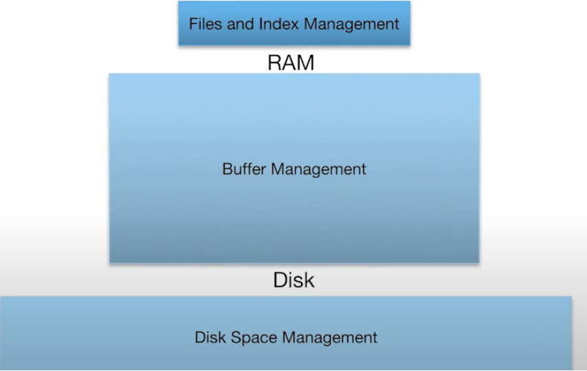
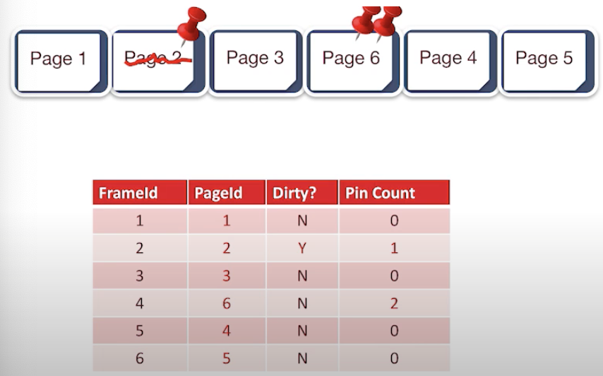
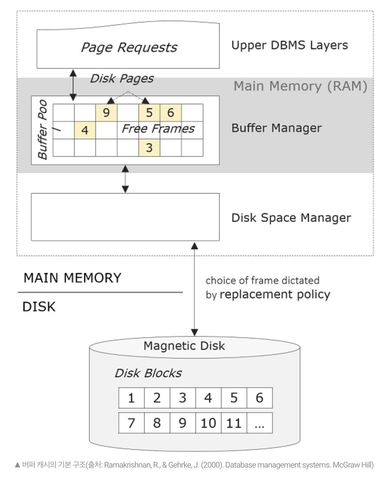
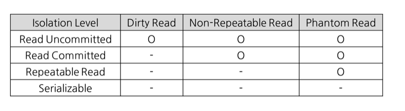

# 1주차 - 김태용

## 핵심 키워드

<aside>
📝

- Disk Space Management
- Buffer Management
- 트랜잭션, 트랜잭션 격리 레벨, 2 Phase Lock
</aside>

## 집중 키워드

```markdown
❗️ Disk Manager
❗️ Buffer Manager
❗️ Dirty Page
❗️ Transaction
❗️ Consistency
❗️ Locking
```

## 학습 정리

- Disk Space Management

  ```markdown
  Disk Space Management 에 대해 어느정도 이해하고
  있어야 할까?

  본격적으로 알아보기 앞서 DBMS는 휘발성이 아닌 하드 디스크에 정보를 저장한다고 이야기 한다.

  핵심은 읽기와 쓰기다.
  우리가 Database를 다루면서 쓰기, 읽기, 조회, 수정, 삭제와
  같이 흔히 말하는 CRUD 작업을 해야 하기 때문에 공부를 해야 한다고 생각한다.

  READ: 디스크 즉, 물리적인 공간에서 메인 메모리 공간에 데이터를 전송하는 작업
  WRITE: RAM, 즉 메인 메모리에서 하드 디스크로 데이터를 전송하는 작업

  I/O 작업에서 발생하는 오버헤드를 생각해보고 다양한 환경을 생각해보면 좋을 것이다.

  캐싱
  데이터의 빠른 조회를 위해 캐싱하는 작업들, 효율을 끌어올리기 위한 다양한 수단이 있지만
  결국 메인 메모리는 휘발성이기에 영구성을 보장할 수 없다는 점에서 Database를 바라보면 좋을 것 같다.

  Disk 구성 요소
  디스크의 구성 요소로는 ARM, Track, Sector, Cylinder 등이 있지만 결국 디스크로부터 컴퓨터는
  블록 단위로 메모리에 읽어 들인다는 점을 꼭 기억하면 좋다.

  I/O 작업이 오버헤드가 큰 이유?
  위에서 언급한 Disk Block을 읽거나 쓰는데 걸리는 시간, 즉 오버헤드가 발생하는 이유이다.
  찾는 시간 + 물리적인 장치가 회전하는데 걸리는 시간 + 데이터 전송하는 시간 등등...

  오버헤드를 줄이기 위한 다양한 방법들
  RAID : Redundant Array Of Inexpensive Disks 데이터 중복성 향상 및 성능 향상을 위한 기법들
  일반적으로 실무에서는 RAID0, RAID1, RAID5, RAID10또는 RAID01을 많이 사용한다고 한다

  그래서 Disk Space Management가 무슨 역할을 하는데?
  정의로는 디스크의 공간 관리를 하며 DBMS Software Architecture에서 lowest level 매니저라고
  하면 이해하기 쉬울 것이다. 조금 더 요약하자면 블록 단위로 디스크로부터 데이터를 읽어오고 메모리 버퍼에
  저장되어 있는 데이터들을 흔히 페이지 블록이라고 한다. 이러한 데이터 단위의 페이지들에 대해 읽고 쓰기를
  위한 메모리 할당과 해제들을 지원한다고 할 수 있겠다! 그래서 이 매니저는 하드웨어와 관련한 작업들을 숨겨주고
  숨겨준다는 의미 -> (하드웨어에 대해 개발자가 고려하는데 시간을 쏟지 않는)
  페이지들 즉, 데이터 유닛들을 다루는데 필요한 사고력, 즉 소프트웨어의 높은 수준에 대해 생각하도록 해준다.
  ```

- Buffer Management
  

  ```markdown
  Buffer Management는 **파일 & 인덱스 와 Disk 사이에 있는 중간 층**이라고 볼 수 있다.
  파일과 인덱스 관리를 하는데 중간의 추상 계층을 제공한다고 볼 수 있는 것이다.

  Buffer Pool은 페이지 단위의 프레임이라고 하는 것의 집합으로 구성되어 있는데, 버퍼 매니저의 주요
  역할은 메인 메모리에서 디스크에 저장된 데이터를 조작하는 것이다. Disk Management는 하드웨어와 관련
  되었다면, Buffer Management 메인 메모리에서 데이터들이 관리되도록? 느끼게 하는 것이 큰 목적이다.

  실제 모든 데이터 Buffer Pool과 Disk 사이에 이루어지게 되는데 만약 데이터를 읽고 싶은 요청이
  버퍼 매니저에게 들어온다면 버퍼 매니저는 디스크 매니저에게 다시 요청하여 버퍼 매니저로 불러온 상태로
  데이터를 반환하게 됨.

  또한 이미 버퍼 매니저에 올라온 데이터를 요청할 경우 -> 디스크 매니저에 요청할 필요 없이 바로
  버퍼 매니저에 있는 데이터를 반환하게 됨.

  **What is Dirty Page?**
  더티 페이지는 메모리에 올라간 데이터와 실제 디스크에 있는 데이터의 내용이 상이한 페이지를 말한다.
  쉽게 말해서, 메인 메모리에 있는 데이터와 실제 디스크에 저장되어 있는 데이터의 내용이 다르다는 것!

  Dirty Page를 관리하는데 두 가지 중요한 점

  1. 버퍼 매니저가 더티 페이지를 어떻게 찾아 낼 것인가?
  2. 더티 페이지를 나중에 디스크에 어떻게 반영할 것인가?

  발생할 수 있는 문제점을 예측해보자면 첫 번째는 동시성 문제가 있다.
  디스크에 데이터들이 반영되기 전에 시스템이 충돌하게 된다면? 데이터가 유실 되기 때문이다.

  Dirty Page는 캐시의 종류라고 보면 이해하기 쉬울 것이다. 특히, 캐시에서 쓰기 작업이 발생했을 때
  디스크에 있는 내용과 달라지게 되는데 이러한 부분에 대한 내용이다.

  Buffer Manager에서 프레임은 테이블처럼 관리가 되는데 Page Id와 Dirty Flag를 가지고 있어서
  디스크에 반영되지 않은 페이지를 확인할 수 있다.

  또한 버퍼 매니저는 핀 카운트를 통해서 해당 페이지가 사용되고 있는지를 확인할 수 있다.
  더하여, 버퍼 매니저가 꽉 채워졌을 때는 교체된다.
  ```

  

  ```markdown
  페이지 요청이 들어온다면 버퍼 매니저에서 생기는 일은?

  1. Pin Count가 0인 프레임을 찾는다.
  2. 만약 프레임이 Dirty Status라면 디스크에 반영하여 깨끗한 상태로 만들고, 디스크 매니저에게 요청한
     데이터를 프레임에 채운다.
  3. 핀 카운트를 증가시키고 주소를 반환한다.
  4. 요청이 끝나고 나서, 데이터가 변경되면 더티 상태로 만들고, 아니더라도 핀을 해제한다!

  프리 패칭
  프리 패칭이란 연속적인 페이지를 읽을 때 디스크 매니저에게 미리 여러개의 페이지를 요청하는 것이다.
  I/O 연산을 줄일 수 있다.

  비용 문제?
  잦은 페이지 부재는 전체 성능이 저하 되므로, 페이지 부재의 발생 빈도를 낮추는 것이 페이지 성능의 주요
  척도가 된다. 이를 위해서 페이지 부재가 일어났을 때 디스크로 내보낼 희생자 페이지를 효율적으로
  선정하는 알고리즘이 페이지 교체 알고리즘이라고 한다. DBMS의 버퍼 캐시는 버퍼 매니저에 의해서 관리되는
  메인 메모리 영역으로 프레임이라는 고정 크기로 분할되어 있다. 만일 모든 프레임이 사용중이라면
  새로운 페이지를 버퍼로 로딩하기 위해서는 비어 있는 대상 프레임을 확보해줘야하는데
  이를 희생자 프레임 선택이라고 한다.
  ```

  

  ```markdown
  \*\*상용 DBMS에서 사용되는 대표적인 교체 알고리즘

  1. LRU Algorithm\*\*

  LRU 알고리즘은 가장 최근에 사용된 버퍼부터 가장 오래된 버퍼까지 다이나믹하게 순서를 유지하면서 배열의
  순서를 유지하고 희생자 프레임을 선택할때는 가장 오래된 버퍼를 선택하는 방식이라고 이해할 수 있다.

  2. Clock Buffer Algorithm

  초기: 버퍼 프레임을 시계 방향으로 나열하고, 현재의 시계 바늘은 가장 첫 번째 프레임을 가리키도록 처음에
  완성시킨다. 그리고 각 프레임의 참조 Count를 0으로 초기화한다. 이어서 프레임이 선택된다면 참조 Count
  를 증가시켜 나아가고 희생자 프레임을 선택할 때는 참조 Count가 0인 프레임을 찾는다.

  이 때, 프레임이 Dirty라면 해당 프레임을 디스크와 동기화시킨다고 할 수 있다.

  참조 Count가 0인 프레임을 찾을 때?
  시계 방향으로 참조 Count가 0이상이라면 -1 연산을 해주고 다음 프레임으로 이동하고 추가로 Pinned
  즉 고정된 상태라면 바로 건너뛴다. 이러한 방식으로 Count가 0인 프레임을 만나면 디스크로부터 읽어들인다.
  ```

- Transaction

  ```markdown
  Transaction이란?
  데이터베이스의 상태를 변화시키기 위해 수행하는 작업 단위라고 알려져 있다.
  트랜잭션은 작업의 완전성을 보장해 주는 것이다. 논리적인 작업 셋을 모두 완벽하게 처리하거나,
  처리하지 못할 경우애는 원 상태로 복구해서 작업의 일부만 적용되는 현상이 발생하지 않게 만들어주는
  기능이다.

  Lock과 Transaction
  잠금과 트랜잭션은 비슷한 개념 같으나 Lock은 동시성을 제어하기 위한 기능이고, Transaction은
  데이터의 정합성을 보장하기 위한 기능이다. 하나의 데이터를 여럴 커넥션에서 동시에 변경하려고 하는데
  잠금이 없다면 하나의 데이터를 여러 커넥션에서 동시에 변경할 수 있게 된다. 결과적으로 해당 레코드
  의 값은 예측할 수 없는 상태가 된다. 잠금은 여러 커넥션에서 동시에 동일한 자원을 요청할 경우
  한 시점에는 하나의 커넥션만 변경할 수 있게 해주는 역할을 한다. 격리 수준이라는 것은 하나의 트랜잭션
  내에서 또는 여러 트랜잭션 간의 작업 내용을 어떻게 공유하고 차단할 것인지를 결정하는 레벨을 의미함.

  상태를 변화시킨다는 것 -> SQL 질의어를 통해 DB에 접근하는 것
  많은 사람들이 트랜잭션에 대해 다룰 때, 은행의 입출금을 통한 예시를 둔다.
  EX) 사용자 A가 사용자 B에게 만원을 송금한다. 1. 사용자 A의 계좌에서 만원을 차감한다. 출금 Update 문 2. 사용자 B의 계좌에서 만원을 추가한다. 입금 Update 문
  이를 통틀어 하나의 트랜잭션이라고 하는데, 작업 단위는 출금 Update문 + 입금 Update문으로 볼 수 있다.
  위 두 쿼리문 모두 성공적으로 완료되어야만 "하나의 작업(트랜잭션)"이 완료되는 것이다. `Commit`
  작업 단위에 속하는 쿼리 중 하나라도 실패하면 모든 쿼리문을 취소하고 이전 상태로 돌아가야함. `Rollback`
  ```

  ### 트랜잭션 특징

  ***

  - 원자성(Atomicity) : 트랜잭션이 Database에 모두 반영되거나, 혹은 전혀 반영되지 않아야함.
    - **All or Nothing / DBMS의 회복 모듈은 시스템이 다운되는 경우,** 부분적으로 데이터베이스를 갱신한 트랜잭션의 영향을 취소함으로써 트랜잭션의 원자성을 보장
  - 일관성(Consistency): 트랜잭션의 작업 처리 결과는 항상 일관성 있어야 한다.
    - 트랜잭션이 수행되는 도중에 데이터베이스가 일시적으로 일관된 상태를 갖지 않을 수 있음 하지만 결과는 일관성을 가짐 ex) 전체 계좌 잔액 합계는 10,000 원
  - 고립성(Isolation): 둘 이상의 트랜잭션이 동시에 병행 실행되고 있을 때, 어떤 트랜잭션도 다른 트랜잭션 연산에 끼어들 수 없다.
    - 예를 들어, 현재 계좌 상태 : My 계좌 10,000, 부모님 계좌 : 0원 / 내 계좌의 10,000 금액에서 부모님 계좌로 5천원을 송금하는 트랜잭션이 수행하는 도중에 부모님 계좌로 10,000원이 입금되는 트랜잭션이 수행됐다면, 총 6000원의 금액이 존재해야 할 부모님 계좌에 여전히 0원으로 알고 있던 5천원 송금 트랜잭션때문에 5000원으로 입력된다. 따라서, 고립성이 보장되어야 함
  - 지속성(Durability): 트랜잭션이 성공적으로 완료되었으면, 결과는 영구적으로 반영되어야 한다.
    - DBMS의 회복 모듈은 시스템이 다운되는 경우에도 트랜잭션의 지속성을 보장함.

  ### UNDO는 왜 필요할까?

  ***

  결국 이전에 우리가 공부한 Disk Space Management와 Buffer Management를 어느정도 이해했다면 내용을 이해하는데 어렵지 않을 것이다.
  작업을 수행하면서 프레임 내 페이지들이 버퍼 관리자의 버퍼 교체 알고리즘에 따라서 디스크에 출력될 수 있다. 작업 도중인데, 버퍼 교체는 전적으로 버퍼의 상태에 따라서 결정되기 때문에 Consistency로 바라봤을 때 문제가 발생함. 즉, 아직 완료되지 않은 트랜잭션이 수정한 페이지들이 디스크에 출력될 수 있으므로 해당 트랜잭션이 어떤 이유든 정상적으로 종료될 수 없게 되면 트랜잭션이 변경한 페이지들은 원상 복구되어야 한다. 이러한 복구를 UNDO라고 부르는 것이다. 만약 버퍼 관리자가 트랜잭션 종료 전에는 어떤 경우에도 수정된 페이지들을 디스크에 쓰지 않는다면, UNDO 작업은 메모리 버퍼에 대해서만 이루어지면 되는 식이다. BUT : 매우 큰 크기의 메모리 버퍼가 필요하다는 문제점 때문에 채택 X
  STEAL 정책

  - STEAL : 수정된 페이지를 언제든지 디스크에 쓸 수 있는 정책
  - ¬STEAL: 수정된 페이지들을 최소한 트랜잭션 종료시점까지는 버퍼에 유지하는 정책
    STEAL 정책은 결국 수정된 페이지가 어떠한 시점에도 디스크에 써질 수 있기 때문에 필연적으로 UNDO 로깅과 복구를 수반하는데 거의 모든 DBMS가 채택하는 버퍼 관리 정책이다.

  ### REDO는 왜 필요할까?

  ***

  이제는 UNDO 복구의 반대 개념인 REDO 복구에 대해 알아볼 것이다.
  커밋한 트랜잭션의 수정은 어떤 경우에도 유지 되어야 한다. 이미 커밋한 트랜잭션의 수정을 재반영하는 복구 작업을 REDO 복구라고 하는데, REDO 복구 역시 UNDO 복구와 마찬가지로 버퍼 관리 정책에 영향을 받음
  트랜잭션이 종료되는 시점에 해당 트랜잭션이 수정한 페이지들을 디스크에도 쓸 것인가 여부로 두가지 정책이 구분

  - FORCE: 수정했던 모든 페이지를 트랜잭션 커밋 시점에 디스크에 반영하는 정책
  - ¬FORCE: 수정했던 페이지를 트랜잭션 커밋 시점에 디스크에 반영하지 않는 정책
    여기서 중요한 점은 ¬FORCE 정책이 수정했던 페이지를 디스크에 반영하지 않는다는 점이지 커밋 시점에 어떠한 것도 쓰지 않는다는 것은 아니다. 어떤 일들을 했었다고 하는 로그는 기록함.
    정리해보면 DBMS는 STEAL과 ¬FORCE 정책을 채택하고 있음.
    따라서 UNDO 복구와 REDO 복구가 모두 필요하다 이러한 복구 작업을 위해 가장 널리 쓰이는 구조가 Log(로그)인 것이다.

  ### Log

  ***

  로그는 로그 레코드의 연속이며 데이터베이스의 모든갱신 작업을 기록함.
  대부분 DBMS는 성능 상의 이유로 하나의 로그를 유지함.
  수정 전 이미지와 수정 후 이미지를 모두 가지고 있으면서 연산이 발생할 때 적절한 조치를 취한다.

  ### Situation

  데이터베이스를 갱신하는 중에 컴퓨터 시스템의 다운이 발생한다면?
  이를 대비해 DBMS가 추가로 정보를 유지하지 않는다면 DBMS가 재가동된 후에 정보를 잃어버릴 것이다.
  모든 트랜잭션에 로그를 파일로 가지고 있어야 함.

- Transaction Isolation Level
  ### Isolation 트랜잭션의 격리 수준?
  ***
  동시에 여러 트랜잭션이 처리될 때, 특정 트랜잭션이 다른 트랜잭션에서 변경하거나 조회하는 데이터를 볼 수 있도록 허용할지 말지를 결정하는 것
  ### 동시성 제어를 하지 않아 생길 수 있는 문제
  ***
  1. 갱신 손실(Lost Update): 수행 중인 트랜잭션이 갱신한 내용을 다른 트랜잭션이 덮어씀으로써 갱신이 무효가 되는 것
  2. 오손 데이터 읽기(Dirty Read): 완료되지 않은 트랜잭션의 갱신한 데이터를 읽는 것
  3. 반복할 수 없는 읽기(Unrepeatable Read): 한 트랜잭션이 동일한 데이터를 두 번 읽을 때 서로 다른 값을 읽는 것
  ### 격리 수준은 어떤게 있을까?
  - READ UNCOMMITTED
    - 설명
      각 트랜잭션에서의 변경 내용이 Commit이나 Rollback 여부에 상관 없이 다른 트랜잭션에서 값을 읽을 수 있는데, 정합성에 문제가 많은 격리 수준이기 때문에 사용하지 않는 것을 권장
      Dirty READ
      따라서 트랜잭션 작업이 완료되지 않았는데도 다른 트랜잭션에서 볼 수 있게 되는 현상이다.
  - READ COMMITED
    - 설명
      RDB에서 대부분 기본적으로 사용되고 있는 격리 수준이다. Dirty READ와 같은 현상이 발생하지 않음 실제 테이블 값을 가져오는 것이 아니라 Undo 영역에 백업된 레코드에서 값을 가져옴.
      그렇다면 READ COMMITED는 문제가 없을까?
      트랜잭션 - 1이 Commit한 이후 아직 끝나지 않는 트랜잭션 - 2가 다시 테이블 값을 읽으면 값이 변경됨을 알 수 있다. 하나의 트랜잭션 내에서 SELECT 쿼리를 실행했을 때는 항상 같은 결과를 가져와야 하는 REPEATABLE READ의 정합성에 어긋난다
  - REPEATABLE READ
    - 설명
      MYSQL에서는 트랜잭션마다 트랜잭션 ID를 부여하여 해당 트랜잭션 ID보다 작은 트랜잭션 번호에서 변경한 것만 읽게 된다. UNDO 공간에 백업해두고 실제 레코드 값을 변경하는데, 백업된 데이터는 불필요하다고 판단하는 시점에 주기적으로 삭제함.
      UNDO에 백업된 레코드가 많아지면 MySQL 서버의 처리 성능이 떨어질 수 있음
  - SERIALIAZABLE
    - 설명
      가장 단순한 격리 수준이지만 가장 엄격한 격리 수준
      성능 측면에서는 동시처리 성능이 가장 낮다.
      SERIALIZABLE 에서는 Phantom Read가 발생하지 않는데 데이터베이스에서 거의 사용되지 않음 Phantom Read는 다른 트랜잭션에서 수행한 변경 작업에 의해 레코드가 보였다 안보이는 현상인데 이를 방지하기 위해서는 쓰기 잠금을 걸어야함.
      
- 2 Phase Lock

  ### 데이터의 일관성을 유지하기 위해 필요한 것이 Lock이라는 장치

  ***

  - 한 트랜잭션이 먼저 접근한 데이터에 대한 연산을 끝낼 때까지는 다른 트랜잭션이 그 데이터에 접근하지 못하도록 상호 배제(Mutual Exclusion)한다.
  - Lock은 데이터베이스 내의 각 데이터 항목과 연관된 하나의 변수로 사용
  - 각 트랜잭션이 접근할 때마다 요청한 Lock에 관한 정보는 Lock Table에 유지

  - 트랜잭션에서 갱신을 목적으로 데이터 항목을 접근할 때는 독점 로크(Exclusive Lock)를 요청함.
  - 트랜잭션에서 읽을 목적으로 데이터 항목을 접근할 때는 공유 로크(Shared Lock)를 요청함.
  - 트랜잭션이 데이터 항목에 대한 접근을 끝낸 후에 Lock을 해제함.

  ### 단순한 Locking의 문제점

  - Lock을 일찍 해제해서 일관성을 위배할 수 있다.

  ### Two-Phase Locking Protocol

  ***

  Two - Phase Locking은 기본 Locking 규약의 문제를 해결하고 트랜잭션의 직렬 가능성을 보장하기 위해 Lock과 Unlock 연산의 수행 시점에 대한 새로운 규약을 추가한 것.
  Lock 확장 단계와 Lock 수축 단계인 2 단계로 나누어 수행함.

  - Lock 확장 단계가 지난 후에 Lock 수축 단계에 들어간다.
  - 일단 Lock이 한 개라도 해제하면 Lock 수축 단계에 들어간다.
    2PL은 구체적으로 한 트랜잭션 안에서 다음의 2가지 Phase로 구성된다.
  - Growing Phase(Phase 1)
    - 트랜잭션은 lock을 obtain할 수 있다.
    - lock을 release할 수 없다.
  - Shrinking Phase(Phase 2)
    - 트랜잭션은 lock을 release할 수 있다.
    - lock을 obtain할 수 없다.
    - Lock의 수축 단계에서 Lock을 조금씩 해제할 수도 있고, 트랜잭션이 완료 시점에 이르렀을 때 한꺼번에 모든 Lock을 해제할 수도 있음.
    - 일반적으로 한꺼번에 해제하는 방식이 사용됨
      Two - Phase Lock은 교착 상태가 발생하지 않도록 보장하지 못한다는 특징이 있음
      Lock Point란? 한 트랜잭션에서 필요한 모든 Lock을 걸어 놓은 시점
      **그럼 Dead Lock이 왜 발생할까?**
  - Dead Lock은 두 개 이상의 트랜잭션들이 서로 상대방이 보유하고 있는 Lock을 요청하면서 기다리고 있는 상태를 말한다.
  - `Dead Lock을 해결하기 위해서는 데드락을 방지하는 기법 또는 데드락을 탐지하고 희생자를 선정하여 데드락을 푸는 기법등이 있다.

## 질문

## 참고자료

[RAID 관련 간단히 보기 좋은 블로그](https://blog.naver.com/sqlmvp/140118943472)

[트랜잭션 Gyoogle](https://gyoogle.dev/blog/computer-science/data-base/Transaction.html)
